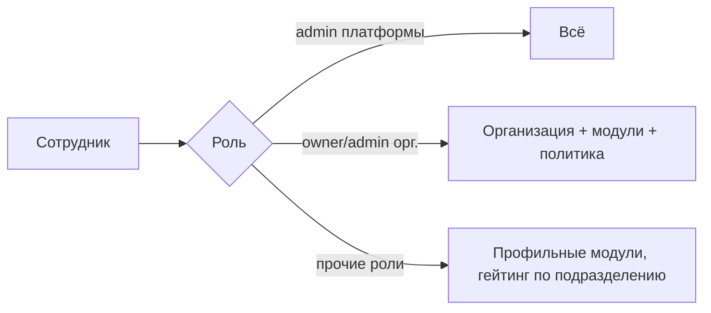
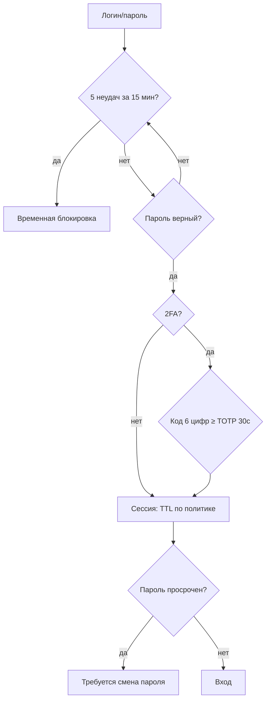
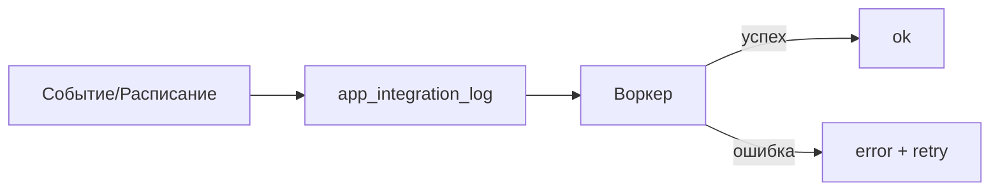

# 3DMP Service — руководство администратора

> Версия: план v4 (W38–W44). Адрес: **https://sapfir.eu/saas/**.
> Два уровня администрирования: **администратор организации** (`owner`/`admin`) и **администратор платформы SAAS** (`admin`).
> Секреты (`service_role`, `sb_secret_*`, Management-токен) — **не** в клиенте и **не** в git.

## Содержание
1. [Роли и доступ](#1)
2. [Администратор организации](#2)
3. [Безопасность (2FA, пароли, сессии, журнал доступа)](#3)
4. [Администратор платформы SAAS](#4)
5. [Интеграции и API](#5)
6. [Расширения (маркетплейс)](#6)
7. [Мониторинг и эксплуатация](#7)
8. [Деплой, миграции, бэкапы](#8)
9. [Матрица ролей и модулей](#9)

<a id="1"></a>
## 1. Роли и доступ
| Роль | Область | Ключевое |
|---|---|---|
| `admin` | Платформа SAAS | Все тенанты, админка, биллинг, расширения (публичные), диагностика |
| `owner` | Организация | Пользователи/роли, модули, тариф, бренд, политика безопасности |
| `manager/director/chief/technologist/operator/master/qc/economist/supply/support` | Организация | Профильные модули |
| `supplier` | Портал поставщика | Закупки/тендеры |
| `client` | Портал клиента | Свои заявки |

Гейтинг: модуль виден в каталоге по полю `roles`; внутри модуля кнопки скрываются по `data-cap`/`CAPS`; ТЗ «owner/admin/manager — все записи, остальные — по подразделению» (R4, включается в Организации).

<a id="2"></a>
## 2. Администратор организации
**Экран «Админ-панель клиента»** (`/saas/apps/org/`), вкладки: **Организация**, **Пользователи**, **Модули**, **Тариф**, **Безопасность**.

```
[Организация][Пользователи][Модули][Тариф][Безопасность]
├ Бренд: Название · Акцентный цвет · Логотип → Сохранить
├ Пользователи: логин/пароль/имя/роль → Добавить; таблица с блокировкой/сменой роли
├ Модули (feature flags): выключенные скрываются у сотрудников
├ Тариф: текущий план → Сменить
└ Безопасность: 2FA, пароль, устройства, политика, журнал
```
Логика доступа:


<a id="3"></a>
## 3. Безопасность (2FA, пароли, сессии, журнал доступа)
**Вкладка «Безопасность»** (организация):
- **Моя безопасность** — статус 2FA; «Настроить» (секрет + ссылка `otpauth://`), код → «Включить»/«Отключить»; **смена пароля** (проверяется политика).
- **Мои устройства/сессии** — список активных сессий (устройство, клиент, активность, срок); завершение по одной («Завершить») или **«Завершить все прочие»**.
- **Политика безопасности организации** — роли, требующие 2FA; мин. длина пароля; срок действия пароля (дней); TTL сессии (минут); список разрешённых IP (задел).
- **Журнал доступа** — попытки входа (успех/отказ) и события (доступ администратору платформы).

Схема защиты входа:

API: `app_2fa_setup/enable/disable`, `app_password_change`, `app_my_sessions`, `app_session_revoke(_all)`, `app_security_policy_get/set`, `app_access_log_list`.

<a id="4"></a>
## 4. Администратор платформы SAAS
Модули (контур «Платформа»):
- **Администрирование** (`admin`) — пользователи/роли платформы, организации.
- **Организации/Холдинг** (`platform`, `holding`) — тенанты, площадки, интеграция.
- **Биллинг** (`billing`) — планы, подписки, счета, просрочки.
- **Использование** (`usage`) — лимиты/статистика тарифов.
- **Права и согласования** (`access`, `roles`) — наборы прав, делегирование, согласования.
- **Интеграции/API** (`integrations`, `api`) — каналы, ключи, вебхуки, лог вызовов, подписи.
- **Расширения** (`marketplace`) — каталог/манифесты/установки (см. §6).
- **Диагностика** (`diagnostics`), **Масштаб** (`scale`), **Файлы** (`files`), **Анонсы** (`announcements`), **White-label** (`whitelabel`), **Конструктор** (`builder`), **Отраслевые пакеты** (`industry`), **Support/ITSM**.

Организации и подписки: `app_plans`, `app_subscriptions`, `app_platform_invoices`; смена тарифа и просрочки видны в «Биллинге».

<a id="5"></a>
## 5. Интеграции и API
**Интеграции** (`apps/integrations`): каналы e-mail/Telegram/SMS/ЭДО/webhook; сообщения ставятся в очередь `app_integration_log` (статусы pending/ok/error), обрабатываются воркером.
**API и интеграции** (`apps/api`): API-ключи организации (`app_api_key_*`), вебхуки, лог вызовов; внешний мониторинг — `app_health_ping(<api_key>)`.
Схема:

Мониторинг обмена: проблемные записи видны в «Диагностике» (kind=integration).

<a id="6"></a>
## 6. Расширения (маркетплейс)
**Модуль «Маркетплейс» → вкладка «Расширения»**: каталог манифестов (тип connector/template/report/dataset/kb/widget/BI), установка по тенанту, включение/удаление. **Редактор манифеста** — для администратора платформы (код, название, тип, версия, зависимости, права, приватность).

Логика установки:
```mermaid
flowchart TD
  C[Каталог app_ext_list] --> I[app_ext_install]
  I --> D{Зависимости deps включены?}
  D -- нет --> X[Отказ: список отсутствующих]
  D -- да --> OK[Установлено (enabled=false)]
  OK --> T[app_ext_toggle enable]
  T -->|connector| G[Точка в app_integrations]
```
Все действия — в журнале (`app_log_event`).

<a id="7"></a>
## 7. Мониторинг и эксплуатация
- **Диагностика** (`apps/diagnostics`): проверки БД/таблиц/функций/Realtime/интеграций/счетов; блок **«Мониторинг доступности»** — KPI (в норме/warn/fail), тренд 14 дней, открытые алерты, кнопки «Проверить сейчас»/«Закрыть».
- **Плановые проверки:** `tools/run-checks.ps1` (audit + db-smoke, лог `dist/checks/`, код 0/1) по расписанию (Task Scheduler) или CI `.github/workflows/checks.yml`.
- **Внешний uptime:** `app_health_ping(<api_key>)`; алерты `app_health_scan` (дедуп `kind:name`, уведомление админам, авто-закрытие).
- **Тренд:** `app_health_trend(days)`.
Детали — `docs/RUNBOOK.md`.

<a id="8"></a>
## 8. Деплой, миграции, бэкапы
- **Сборка:** `tools/build-release.ps1` → `dist/saas-<дата>.zip` (не в git).
- **FTP:** залить в `sapfir.eu\saas`: `index.html`, `apps/`, `assets/`, `eco/`, `web.config`, `manifest.webmanifest`, `sw.js`. **Не льются:** `supabase/`, `docs/`, `tools/`, `dist/`, `.git`, `.github`. После — **Ctrl+F5**.
- **Миграции:** `supabase/migrations/NNNN_*.sql` (или `apply_all.sql`) через SQL Editor / Management API (UTF-8, идемпотентно); после — `tools/db-smoke.ps1`.
- **Бэкапы/DR:** средствами Supabase (см. `scale`); секреты — в vault/CI.
- **Производительность:** индексы по горячим запросам (W44); при росте — `EXPLAIN ANALYZE`, составные индексы.

<a id="9"></a>
## 9. Матрица ролей и модулей
| Контур | owner/admin | manager/director/chief | master/technologist/operator | qc | economist | supply | supplier | client |
|---|---|---|---|---|---|---|---|---|
| Продажи/закупки | ✔ | ✔ | — | — | — | ✔/✔ | ✔ | ✔(свои) |
| КТПП/Производство | ✔ | ✔ | ✔ | — | — | — | — | — |
| Качество | ✔ | ✔ | — | ✔ | — | — | — | — |
| Экономика/BI | ✔ | ✔ | — | — | ✔ | — | — | — |
| Персонал | ✔ | ✔ | — | — | — | — | — | — |
| Платформа/админка | ✔ | — | — | — | — | — | — | — |
| Расширения/диагностика | admin платформы | — | — | — | — | — | — | — |

> Смежные документы: `USER_GUIDE.md` (пользователь), `MODULE_REFERENCE.md` (модули), `RUNBOOK.md` (дежурство), `RELEASE.md` (релиз), `MODULE_STANDARD.md` (разработка).
