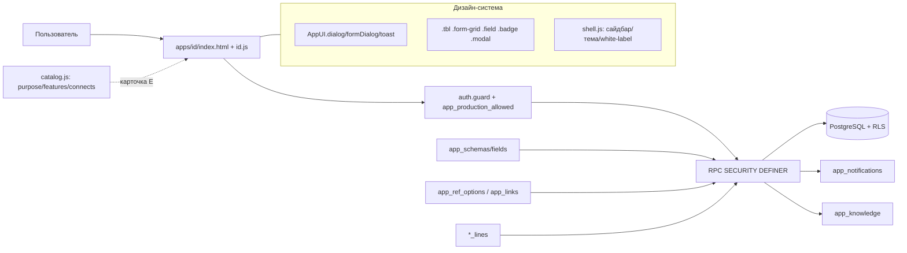

# MODULE_GUIDE — как устроен и как создаётся модуль 3DMP Service

Дополняет `MODULE_STANDARD.md` (жёсткие правила каркаса) и `PLAN_MODERNIZATION.md` (принцип **SR-LWE**).
Документ для разработчиков; входит в деплой-набор? **Нет** — `docs/` на FTP не льётся.

## 1. Принцип SR-LWE
Каждый боевой модуль строится по единому принципу:

| Буква | Значение | Средства платформы |
|---|---|---|
| **S** Schema | тип описывается схемой полей → динамическая форма | `app_schemas`, `app_schema_fields`, `AppUI.formDialog` |
| **R** Refs | значения из НСИ/справочников; связи между сущностями | `app_ref_options`, `app_links`, `apps/dicts`, `apps/registry` |
| **L** Lines | табличные части (позиции/операции/строки) | `*_lines`-таблицы + RPC `<entity>_lines_list/save` |
| **W** Workflow | статусы, версии, печать/выгрузки | статусы в RPC, `app_document_versions`, `Export`, печать страницы |
| **E** Explain | карточка модуля: назначение/для кого/как/функции/связи | запись в `assets/js/catalog.js` (`purpose/features/connects`) |

Зрелость: **L1 CRUD → L2 связи/НСИ → L3 конструктор/таблицы/печать → L4 автоматизация**.
Цель: **L3** для ключевых модулей, **L2** для всех.

## 2. Анатомия модуля
```
apps/<id>/
  index.html      — каркас: topbar + hero + карточки + modal/print + скрипты (?v=N)
  <id>.js         — IIFE: guard → RPC → рендер → обработчики; весь текст русский
```
Подключение скриптов (порядок): `config → supabase-client → ui → status(при н.обх.) → auth → notify → support-widget → nav → shell(для сайдбара) → <id>.js → realtime`.

Запись в каталоге (`assets/js/catalog.js`, единый источник):
```js
{ id, icon, title, href: 'apps/<id>/index.html', guest:false, group, audience, roles?,
  desc, purpose, features:[...], connects:[...], in_, out }
```

## 3. Как добавить модуль
1. **Миграция** `supabase/migrations/NNNN_<id>.sql` — таблицы (+RLS), RPC (SECURITY DEFINER), идемпотентно; в plpgsql с `RETURNS TABLE(...id...)` — `#variable_conflict use_column`; при смене типа — `drop function` перед `create`.
2. **Применение** через Management API **только с UTF-8 body**; прогнать `app_smoke_test`/`app_smoke_test_ext`.
3. **Пересобрать** `supabase/apply_all.sql` (добавить блок с маркерами).
4. **Приложение** `apps/<id>/` по стандарту; подключить общие JS/CSS/компоненты (`AppUI.dialog/formDialog/toast`, `.tbl/.form-grid/.field/.badge`, `shell.js`).
5. **Каталог** — запись в `catalog.js`; поднять версию каталога и `CATALOG_V` в `nav.js`/`shell.js`.
6. **БЗ** — статья в `app_knowledge`; **карточка/E** — `purpose/features/connects`.
7. **Версии** — поднять `?v=N` у изменённых ассетов.
8. **Коммит/пуш**; обновить `STATUS/NOTES/PLAN/PROMPTS`.

## 4. RPC-конвенции
- Вход — `p_token uuid`, первый шаг: `app_production_allowed(p_token)`; далее роль/`app_guard(p_token, module, action)`.
- Tenant-изоляция: `app_my_tenant(p_token)`; admin (`urole='admin'` или членство в платформе) видит всё.
- Возврат — `TABLE(...)`; изменяющие — `TABLE(ok boolean, message text)` / `TABLE(id uuid, ...)`.
- Побочные эффекты — `app_notif_roles_t(...)`, `window.Auth.log(...)` на клиенте.

## 5. Схема (Mermaid)


## 6. Чек-лист готовности (DoD)
- [ ] Идемпотентная миграция (UTF-8), применена, смоук 100%.
- [ ] `apply_all.sql` пересобран.
- [ ] `apps/<id>/` по стандарту; id HTML/JS совпадают; скобки сбалансированы.
- [ ] Общие компоненты (не локальные дубли стилей).
- [ ] Запись в каталоге (`purpose/features/connects`, group, audience, roles).
- [ ] Статья в БЗ; версии `?v=N` подняты.
- [ ] Коммит/пуш; обновлены `STATUS/NOTES/PLAN/PROMPTS`.

## 7. Смотри также
`MODULE_STANDARD.md`, `PLAN_MODERNIZATION.md`, `ECOSYSTEM_MAP.md`, `LIMITS.md`, `DESIGN_SYSTEM.md`, `PROTOTYPES.md`.
