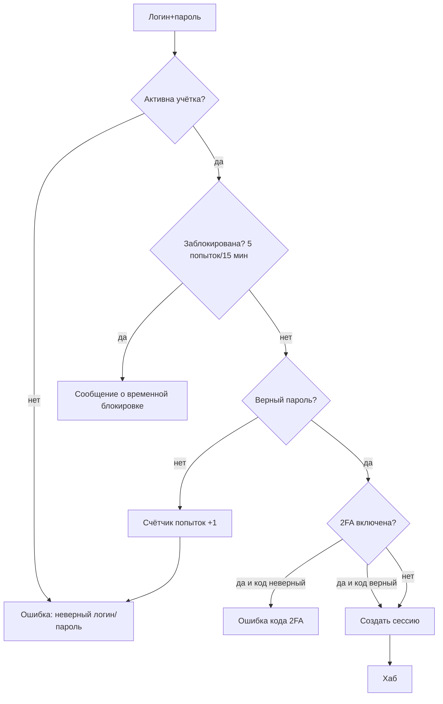
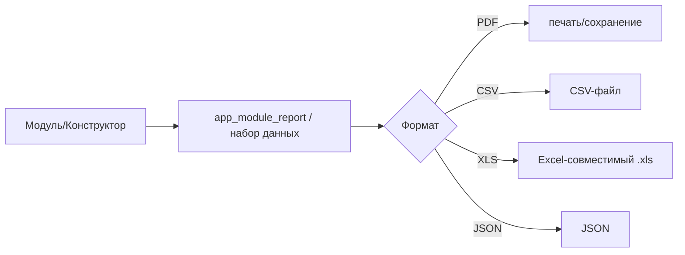
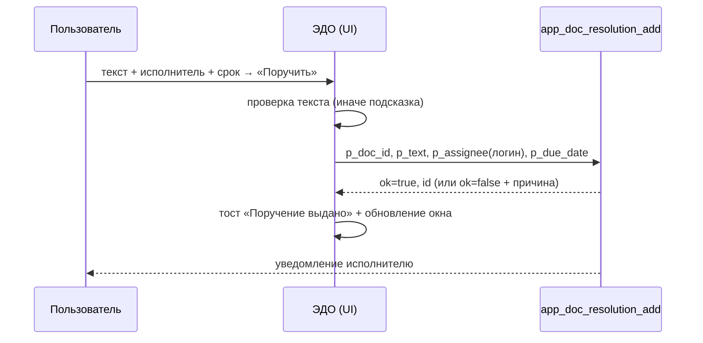

# 3DMP Service — руководство пользователя

> Версия: план v4 (W38–W44). Адрес: **https://sapfir.eu/saas/**. Встроенная справка — «Гид по системе» и база знаний (категории «Справка»/«Администрирование»).
> Скриншоты: ниже экраны описаны схемой и логикой; фактические изображения можно добавить в `docs/img/` (папка не деплоится на FTP).

## Содержание
1. [Вход и роли](#1)
2. [Хаб (главная)](#2)
3. [Навигация и типовой экран модуля](#3)
4. [Отчёты и выгрузки](#4)
5. [Мастера (пошаговые сценарии)](#5)
6. [Мобильный режим, установка и офлайн](#6)
7. [ЭДО: пошаговый пример](#7)
8. [Модули по контурам (с примерами экранов)](#8)
9. [Типовые вопросы и проблемы](#9)

<a id="1"></a>
## 1. Вход и роли
**Экран «Вход»** (`/saas/apps/auth/`): поля **Логин**, **Пароль** (и **Код 2FA**, если включена двухфакторная аутентификация).

Схема:
```
[ Логин ] [ Пароль ] [ Код 2FA (при включении) ]   [ Войти ]
```
Логика (mermaid):

Роли: `admin` (SAAS), `owner` (организация), `manager`, `director`, `chief`, `master`, `technologist`, `operator`, `supply`, `qc`, `economist`, `support`, `supplier`, `client`. Видимость модулей зависит от роли.

<a id="2"></a>
## 2. Хаб (главная)
**Экран «Хаб»** (`/saas/index.html`) — каталог модулей.

Схема:
```
┌───────────────────────────────────────────────────────────┐
│  [поиск]  (Все) (Продажи) (Производство) (⭐ Избранное)     │  ← панель фильтров + режим Обычный/Компактно
├───────────────────────────────────────────────────────────┤
│ ⚡ Быстрый доступ   🕘 Недавние                            │
│ ┌ Продажи и заказы ─┐ ┌ Производство ─────┐ ┌ Платформа ─┐ │  ← карточки-группы в колонках
│ │ [плитка][плитка]  │ │ [плитка][плитка]  │ │ ...        │ │
│ │ [плитка][плитка]  │ │ ...               │ │            │ │
│ └───────────────────┘ └───────────────────┘ └────────────┘ │
└───────────────────────────────────────────────────────────┘
```
- **Поиск** — по названию/описанию/связям модуля.
- **Фильтр-чипы** — по контурам и «⭐ Избранное».
- **Избранное** — звёздочка ★ на плитке (хранится в браузере).
- **Недавние** — последние открытые модули.
- **Компактно** — скрывает описания, показывает больше плиток.
- Плитка: иконка, название, краткое описание, ★ (и 🔒, если нужен вход).
- Группы сворачиваются кликом по заголовку; счётчик показывает число модулей.

<a id="3"></a>
## 3. Навигация и типовой экран модуля
В каждом модуле сверху: **Тема**, **Сервер**, **Пользователь**, **Выйти**; слева — меню (☰). Под шапкой — **хлебные крошки** «🏠 Каталог › Группа › Модуль» и кнопка **«← Назад»** (возврат в предыдущее меню; если истории нет — к группе модуля в Хабе).

Схема экрана модуля:
```
🏠 Каталог › Производство › Наряды        [← Назад]
┌ Фильтры: [статус ▾] [центр ▾] [поиск…] ┐
│ Таблица/карточки, кнопки действий      │
└────────────────────────────────────────┘
```

<a id="4"></a>
## 4. Отчёты и выгрузки
В модуле — кнопка **«📄 Отчёт»** (PDF), **CSV**, **XLS**. Раздел **«Отчёты и экспорт»** добавляет:
- **Конструктор** — наборы данных по контурам (заявки, наряды, закупки, склад, ОТК, маршруты + 16 наборов новых модулей), выбор колонок, фильтры по датам, группировка, график, сохранение определений.
- **Дашборд новых модулей** и **Дашборд по контурам** (KPI).
- **Расписание рассылки** — отчёт по модулю ставится в очередь и отправляется выбранным каналом (e-mail/Telegram/webhook) по расписанию (день/неделя/месяц).

Логика выгрузки:


<a id="5"></a>
## 5. Мастера (пошаговые сценарии)
Мастера проводят по шагам с проверкой и сохранением **черновика** (можно прервать и продолжить). Кнопка «＋ … (мастер)» есть в модулях: **НСИ**, **Инструмент**, **Склад (приёмка)**, **Процессы**, **КЭДО**, **Логистика** (и на мобильной панели).

Схема:
```
Мастер: шаг ●●●○   [Назад] [Далее] / [Готово]     (Esc — закрыть)
Шаг 1 ─ форма ─ проверка ─ Шаг 2 ─ … ─ Создать сущность
```

<a id="6"></a>
## 6. Мобильный режим, установка и офлайн
- Откройте модуль на телефоне — появится нижняя **панель быстрых действий** (или включите режим кнопкой **📱**, адрес `?mobile=1`).
- Сервис — **PWA**: «Добавить на главный экран».
- **Офлайн:** часть действий (например, измерение ОТК, фото к сущности) ставится в очередь и отправляется при появлении сети; справочники (НСИ, задачи) доступны из кэша чтения.
- **Скан/фото:** в мобильной панели — «📷 Скан ШК» (камера или ручной/USB-сканер) и «🖼 Фото» (камера) с привязкой к модулю.

<a id="7"></a>
## 7. ЭДО: пошаговый пример
**Модуль «ЭДО»** (`/saas/apps/edo/`): реестр документов, регистрация, поручения, связи, номенклатура дел.

Пошагово (входящее письмо → поручение):
1. **Создать документ**: «＋ Документ» → тип (входящее/исходящее), заголовок, корреспондент, ответственный, срок.
2. Открыть документ двойным кликом → окно **«Документ»**:
   - кнопки **Зарегистрировать / В работу / Закрыть** (жизненный цикл);
   - **Связь**: тип (order/invoice/customer…), примечание → «Добавить связь»;
   - **Поручение**: текст, **Исполнитель** (выбор из пользователей организации), срок → **«Поручить»**;
   - внизу — **В дело** (номенклатура) → «В архив».
3. После выдачи поручения окно обновляется, поручение видно в таблице со статусом **open**; исполнителю приходит уведомление.
4. Исполнитель открывает документ и нажимает **«Выполнено»** (статус → done).

Логика поручения:

Историю из чата: ранее кнопка «Поручить» при пустом поле/ошибке «молчала»; теперь есть подсказки, тосты и обновление окна без закрытия.

<a id="8"></a>
## 8. Модули по контурам (с примерами экранов)
- **Продажи и заказы**: Заявки, CRM, ТКП (коммерческое предложение), Портал клиента; Закупки/Поставщики; Документы/Шаблоны/Этикетки; **Маркетплейс мощностей**. Экран заявок: таблица + карточка заявки и переход «Наряд».
- **КТПП**: Справочники, Спецификации (BOM), Маршруты/УП (ЧПУ), Расчёты, Нормы. Экран маршрута: операции, времена, себестоимость.
- **Производство**: Наряды, Диспетчерская (MES, канбан), Планирование (Ганта, APS), Слоты, Прогноз загрузки, Наладка, Бережливое, Пульт оператора (терминал), Сервис/ТОиР, IIoT, Склад. Вкладка «Аналитика» — APS-очередь, предиктив ТОиР, SPC-сигналы.
- **Качество**: ОТК, Претензии, Паспорта, СМК; **SPC** (сигналы вне 2σ/3σ).
- **Экономика**: Себестоимость/Сметы, Финансы/Бюджеты, Платёжный календарь, Эскроу, BI/Отчёты.
- **Персонал**: Кадры, Компетенции, Подразделения, Организация.
- **Платформа и администрирование**: Организация, Пользователи, **ЭДО**, **КЭДО**, Задачи, Процессы (workflow), Интеграции, API, **Расширения**, **Диагностика**, Биллинг, Анонсы, White-label, Гид.

Пример: **Наряды** (Производство)
```
Наряд NAR-00012 · Заказ SO-2026-01 · Статус: в работе
Операции: [Токарная 40м ✔] [Фрезерная 55м ▶] [Шлифовка 20м]
[Пауза] [Готово]  → списание времени, следующий наряд
```

<a id="9"></a>
## 9. Типовые вопросы и проблемы
- **Поле выглядит «просто/некрасиво».** Обновите страницу **Ctrl+F5** (стили `app.css v36`).
- **Модуль не виден.** Проверьте роль и feature-flags организации (админ).
- **Не приходит код 2FA.** Проверьте время на телефоне (TOTP чувствителен к часам).
- **Не отправилось офлайн.** Очередь отправится при восстановлении сети; проверьте индикатор очереди.
- **Поручение не появляется.** Введите текст поручения (обязательно), выберите исполнителя из списка, нажмите «Поручить»; окно обновится с тостом.

> Смена пароля и устройства — в админ-панели: **Организация → Безопасность** (см. `ADMIN_GUIDE.md`).
